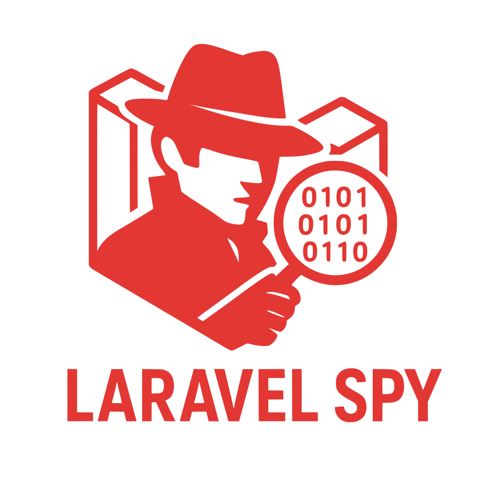

<p align="center">
    
</p>

<p align="center">
    <a href="https://packagist.org/packages/farayaz/laravel-spy">
        
    </a>
    <a href="https://packagist.org/packages/farayaz/laravel-spy">
        
    </a>
    <a href="https://packagist.org/packages/farayaz/laravel-spy">
        
    </a>
</p>

# Laravel Spy

**Laravel Spy** is a lightweight Laravel package designed to track and log outgoing HTTP requests made by your Laravel application.

This package is useful for debugging, monitoring, and auditing external API calls or HTTP requests, providing developers with a zero config, simple way to inspect request details such as URLs, methods, headers, and responses.

## Features

- Tracks all outgoing HTTP requests made via Laravel's HTTP client.
- Tracks outgoing requests made with Guzzle (enabled by default).
- Logs request details, including URL, method, headers, payload, and response.
- Configurable logging options to customize and obfuscate sensitive data.

## Requirements

- **PHP**: ^8.1
- **Laravel**: ^10.0 | ^11.0 | ^12.0 | ^13.0
- **Development Dependencies** (optional):
  - `laravel/pint`: ^1.0 (for code style linting)
  - `phpunit/phpunit`: ^9.0 | ^10.0 | ^11.0 (for running tests)

## Installation

You can install the package via Composer:

```bash
composer require farayaz/laravel-spy
```

The package uses Laravel's auto-discovery feature. After installation, the package is ready to use with its default configuration.
```bash
php artisan vendor:publish --provider="Farayaz\LaravelSpy\LaravelSpyServiceProvider"
```
```bash
php artisan migrate
```


## Usage
Once installed and configured, Laravel Spy automatically tracks all outgoing HTTP requests made using Laravel's Http facade and Guzzle. The package logs the following details for each request:
* The full URL of the request
* The HTTP method (e.g., GET, POST, PUT)
* Request Headers
* Request Body
* Response Header
* Response Body
* Response HTTP Status code
* Request duration (milliseconds)

## Example:
After installing `laravel-spy` and publishing the configuration, any usage of Laravel's HTTP client (for example, in your controllers or jobs) will be automatically logged.

Laravel Spy will log the details of this outgoing request to the `http_logs` table in your database.

```php
Http::get('https://github.com/farayaz/laravel-spy/');
```

## Quick Configuration

Configure these via environment variables:

```bash
SPY_ENABLED=true
SPY_DASHBOARD_ENABLED=false
```

## Documentation

- [Configuration](docs/configuration.md)
- [Guzzle Integration](docs/guzzle.md)
- [Dashboard](docs/dashboard.md)
- [Cleanup and Retention](docs/cleanup.md)
- [Troubleshooting](docs/troubleshooting.md)
- [Upgrade Guide](docs/upgrade.md)
- [Contributing](docs/contributing.md)
- [Testing Guide](README_TESTING.md)

## Issues
If you encounter any issues or have feature requests, please open an issue on the GitHub repository. Provide as much detail as possible, including:
* Laravel version
* PHP version
* Package version
* Steps to reproduce
* Expected vs. actual behavior
* Any relevant error messages or logs

## License
Laravel Spy is open-sourced software licensed under the MIT License.

## Contact
For questions or support, reach out via the GitHub repository or open an issue.
